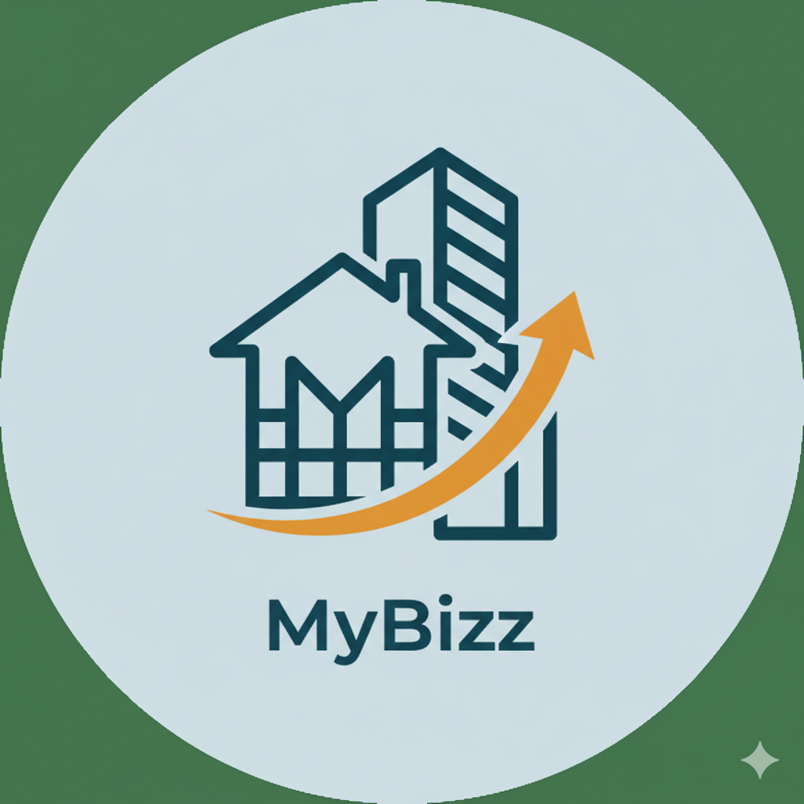

# MyBizz - Billing Management App



## 📱 App Overview

MyBizz is a comprehensive billing management application developed as my first freelance project to help small business owners manage their invoices, expenses, and client billing across multiple service categories including **Rental**, **Task**, **Construction**, and **Plot** management.

## 🚀 Features

### Core Functionality
- **Multi-Category Billing**: Create and manage bills for:
  - 💰 General Billing Service - Custom invoices, expense tracking, client billing
  - 🏠 Rental Services
  - ✅ Task-based Projects
  - 🏗️ Construction Projects
  - 📊 Plot Management
  
### Bill Management
- ✅ Create new bills with detailed information
- ✏️ Edit existing bills
- 🗑️ Delete bills
- 💰 Mark bills as Paid/Unpaid
- 📱 Intuitive bill status tracking

### Technical Features
- 🔐 **Firebase Authentication** - Secure user login and registration
- 📊 **Google Sheets API Integration** - Cloud-based data storage
- 🎨 **Jetpack Compose UI** - Modern, responsive user interface
- 📊 **Real-time Data Sync** - Automatic synchronization with Google Sheets

## 🛠️ Technology Stack

- **Language**: Kotlin
- **UI Framework**: Jetpack Compose
- **Authentication**: Firebase Authentication
- **Backend Storage**: Google Sheets API
- **Architecture**: MVVM (Model-View-ViewModel)
- **Navigation**: Jetpack Navigation Compose

## 🏗️ Project Architecture

### Package Structure
```
eu.tutorials.mybizz/
├── ui/
│   ├── theme/
│   ├── screens/
│   │   ├── Auth/
│   │   │   ├── LoginScreen.kt
│   │   │   ├── SignUpScreen.kt
│   │   │   └── SplashScreen.kt
│   │   ├── Dashboard/
│   │   │   ├── UserDashBoardScreen.kt
│   │   │   └── AdminDashBoardScreen.kt
│   │   ├── Bills/
│   │   │   ├── BillsListScreen.kt
│   │   │   ├── AddBillScreen.kt
│   │   │   ├── EditBillScreen.kt
│   │   │   └── BillDetailScreen.kt
│   │   ├── Categories/
│   │   │   ├── ConstructionScreen.kt
│   │   │   ├── RentalScreen.kt
│   │   │   ├── TaskScreen.kt
│   │   │   ├── PlotScreen.kt
│   │   │   └── PlotAndConstructionEntry.kt
│   │   └── Management/
│   │       ├── ProfileScreen.kt
│   │       ├── UserManagementScreen.kt
│   │       ├── SettingsScreen.kt
│   │       └── AboutScreen.kt
│   └── navigation/
│       ├── NavGraph.kt
│       └── Routes.kt
├── logic/
│   ├── auth/
│   │   └── AuthRepository.kt
│   ├── bill/
│   │   ├── BillRepository.kt
│   │   └── BillSheetsRepository.kt
│   ├── construction/
│   │   ├── ConstructionRepository.kt
│   │   └── ConstructionSheetsRepository.kt
│   ├── rental/
│   │   ├── RentalRepository.kt
│   │   └── RentalSheetsRepository.kt
│   ├── task/
│   │   ├── TaskRepository.kt
│   │   └── TaskSheetsRepository.kt
│   ├── plot/
│   │   ├── PlotRepository.kt
│   │   └── PlotSheetsRepository.kt
│   └── Abc.kt
├── model/
│   ├── Bill.kt
│   ├── User.kt
│   ├── Construction.kt
│   ├── Rental.kt
│   ├── Task.kt
│   ├── Plot.kt
│   └── MenuItem.kt
└── MainActivity.kt & MyBizzApp.kt
```

### Repository Pattern
The app uses a sophisticated repository pattern with separate repositories for each category:

- **AuthRepository**: Handles Firebase authentication
- **BillRepository**: Manages general bill operations
- **Category-specific Repositories**: 
  - `ConstructionRepository` & `ConstructionSheetsRepository`
  - `RentalRepository` & `RentalSheetsRepository`
  - `TaskRepository` & `TaskSheetsRepository`
  - `PlotRepository` & `PlotSheetsRepository`

## 🔧 Setup Instructions

### Prerequisites
- Android Studio Arctic Fox or later
- Kotlin 1.5.30 or later
- Android SDK 21 or later
- Google account for Sheets API
- Firebase project

### Installation Steps

1. **Clone the repository**
   ```bash
   git clone https://github.com/your-username/mybizz.git
   ```

2. **Configure Firebase**
   - Create a new Firebase project
   - Enable Authentication
   - Download `google-services.json` and place it in `app/` directory

3. **Setup Google Sheets API**
   - Enable Google Sheets API in Google Cloud Console
   - Create credentials (API key) for each category
   - Update API configurations in respective repository files

4. **Build and Run**
   ```bash
   ./gradlew build
   ```

## 📋 Usage Guide

### Authentication
1. **Launch the app** - Start with SplashScreen
2. **Login/SignUp** - Use Firebase authentication
3. **Role-based Access** - Different dashboards for Users and Admins

### Bill Management
1. **Navigate to Bills** - Access from dashboard
2. **Create Bill** - Select category and fill details
3. **Manage Bills** - Edit, delete, or mark as paid
4. **View Details** - Comprehensive bill information

### Category-specific Features

#### 🏗️ Construction
- Project-based billing
- Material and labor cost tracking
- Construction milestone management

#### 🏠 Rental
- Property rental invoices
- Tenant and lease management
- Monthly rental tracking

#### ✅ Task
- Task-based project billing
- Hourly/daily rate calculations
- Project completion status

#### 📊 Plot
- Land management billing
- Plot-specific calculations
- Area-based pricing

## 🔐 Security Features

- **Firebase Authentication** with email/password
- **Secure API communication** with Google Sheets
- **Role-based access control**
- **Data validation** and error handling

## 💾 Data Management

### Google Sheets Integration
Each category has dedicated Sheets repositories:
- **Real-time data synchronization**
- **Structured data organization**
- **Automatic backup** and recovery
- **Cross-platform accessibility**

### Local Data Models
- **Bill.kt** - Main bill data structure
- **User.kt** - User profile management
- **Category-specific models** for specialized data

## 🎨 UI/UX Features

- **Material Design 3** components
- **Jetpack Compose** for modern UI
- **Responsive design** for all screen sizes
- **Smooth navigation** with NavGraph
- **Theme consistency** across all screens

## 🔄 Core Operations

### CRUD Operations
- **Create**: Add new bills across all categories
- **Read**: View bill lists and details
- **Update**: Edit existing bill information
- **Delete**: Remove bills with confirmation

### Status Management
- **Paid/Unpaid** status tracking
- **Payment date** recording
- **Bill filtering** by status and category

## 📊 Future Enhancements

- [ ] PDF invoice generation and sharing
- [ ] Advanced analytics and reporting
- [ ] Client management system
- [ ] Payment reminder notifications
- [ ] Offline mode support
- [ ] Multi-language localization
- [ ] Dark/Light theme toggle

## 🤝 Contributing

We welcome contributions! Please feel free to submit pull requests or open issues for bugs and feature requests.

## 📄 License

This project is licensed under the MIT License - see the [LICENSE.md](LICENSE.md) file for details.

## 📞 Support

For support and queries, please contact:
- Email: dhananjayingole2004@gmail.com
- GitHub Issues: [Create an issue](https://github.com/your-username/mybizz/issues)

## 🏆 Acknowledgments

- Jetpack Compose team for excellent UI framework
- Firebase team for robust authentication
- Google Sheets API for flexible data storage
- Material Design for beautiful components

---

<div align="center">

**Built with ❤️ using Kotlin, Jetpack Compose, Firebase & Google Sheets API**

</div>
